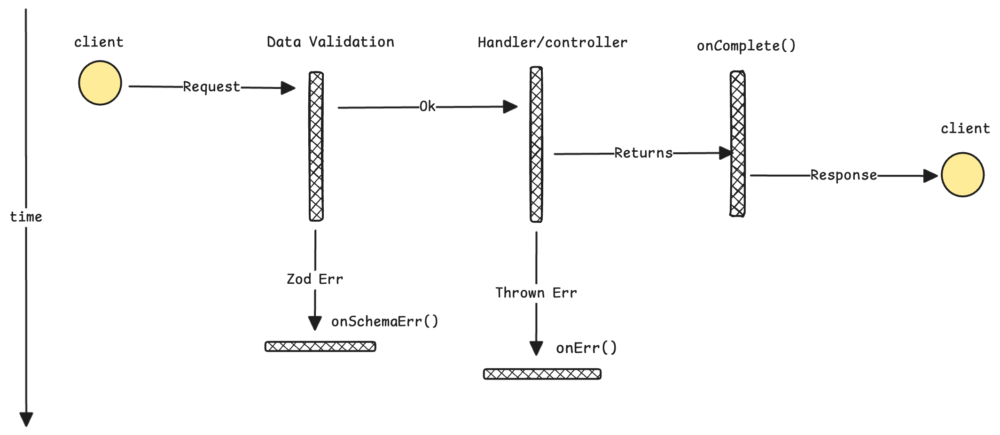

<p align="center">
  <h1 align="center">Suvidha</h1>
</p>

# Why one more package?

I work with [typescript](https://www.typescriptlang.org/) and [Express.js](https://expressjs.com/) a lot. There were couple of things I wanted,

-   **Type-safe** request handling.
-   Easy response handling.

And I was not looking for a solution that will Hack over Express.js like [Nest.js](https://nestjs.com/).
Something easy to plugin and unplug.

# Hence Suvidha.

Suvidha is a TypeScript library improves Express.js experience by providing:

-   Type-safe request handling using [Zod](https://zod.dev/)
-   Easy response handling



## Installation

```bash
npm install @waffles-lab/suvidha
```

## Ok show me the code

1. Type-safe request handling.

```typescript
// examples/pipe/book.example.ts

// When validation fails, onSchemaErr is called
const onSchemaErr = (err: ZodError, conn: Connection, next: NextFunction) => {
    conn.res.status(StatusCodes.BAD_REQUEST).json({
        status: "error",
        data: "Data provided does not meet the required format.",
        meta: {
            reason: err.flatten(),
        },
    });
};

// Create a pipe factory
const pipe = () => new Pipe(onSchemaErr); // onSchemaErr is optional

const bookSchema = z.object({ name: z.string() });
const bookId = z.object({ id: z.string() });

app.post(
    "/store/:id/books",
    // create a middleware to validate the request
    pipe().body(bookSchema).params(bookId).validate(),
    // req is typed as Request<{ id: string }, any, { name: string }>
    (req, res) => {
        const { name } = req.body; // Type of body: { name: string }
        const { id } = req.params; // Type of params: { id: string }
        // do some stuff...
        res.status(200).json({
            data: {
                message: "book created successfully",
                book: {
                    name,
                    id,
                },
            },
            status: "success",
            meta: {},
        });
    },
);
```

2. Type-safe request handling and easy response handling.

```typescript
// examples/suvidha/book.example.ts

// Create a Suvidha factory
const suvidha = () => Suvidha.create(DefaultHandlers.create());

const bookSchema = z.object({ name: z.string() });
const bookId = z.object({ id: z.string() });

app.post(
    "/store/:id/books",
    // validation is similar to pipe
    suvidha()
        .body(bookSchema)
        .params(bookId)
        // req is typed as Request<{ id: string }, any, { name: string }>
        .prayog((req, _) => {
            const { name } = req.body; // Type of body: { name: string }
            const { id } = req.params; // Type of params: { id: string }
            // do some stuff...
            // return the body, rest will be handled by default handlers
            return {
                message: "book created successfully",
                book: {
                    name,
                    id,
                },
            };
        }),
);
```

Both of the above examples produce the same output:

```json
{
    "status": "success",
    "data": {
        "message": "book created successfully",
        "book": {
            "name": "foo",
            "id": "bar"
        }
    },
    "meta": {}
}
```

## Glossary

-   **Connection**: The connection object is an object that contains the request and response objects.

    ```typescript
    // simplified version
    type Connection = {
        req: Request;
        res: Response;
    };
    ```

-   **Handlers**: The handlers object is an object that contains the `onErr()`, `onSchemaErr()`, `onComplete()`, and `onUncaughtData()` functions.
-   **Pipe**: The pipe is a middleware that validates the request, and calls `next()` if the validation succeeds.
    Otherwise, it calls `onSchemaErr()` which is an optional callback function that you can define.

## Let's talk about Pipe a bit

If you just want to validate the request, you can use the pipe.

**Pipe** is a middleware that validates the request, and calls `next()` if the validation succeeds.
Otherwise, it calls `onSchemaErr()` which is an optional callback function that you can define.
If you don't define it, validation errors will be passed to the `next()` as an argument, `next(err)`.

```typescript
// signature of onSchemaErr
const onSchemaErr = (err: ZodError, conn: Connection, next: NextFunction) => {
    // do something with the error ...
};
const bookSchema = z.object({ name: z.string() });

// either pass onSchemaErr as an argument to `Pipe`
const pipe = () => new Pipe(onSchemaErr);

// you can also pass onSchemaErr as an argument to validate
const validationMiddleware = pipe().body(bookSchema).validate(onSchemaErr);
```

Validation errors are passed to as follows:

1. `onSchemaErr` of `vaildate` if supplied
2. `onSchemaErr` of `Pipe` if supplied
3. `next` of Express.js

## Contributing

Pull requests are welcome. For major changes, please open an issue first
to discuss what you would like to change.

Please make sure to update tests as appropriate.

## License

[MIT](https://choosealicense.com/licenses/mit/)
