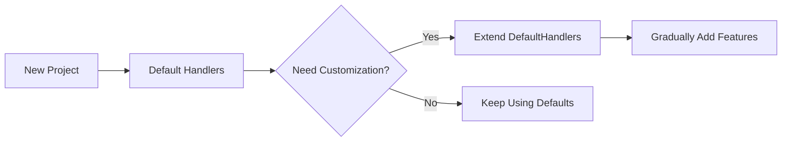

# Using Suvidha Handlers

## Default Handlers Example

### User Registration Endpoint

```typescript Implementation
import { Suvidha, DefaultHandlers, Http } from 'suvidha';
import { z } from 'zod';

const userSchema = z.object({
  email: z.string().email(),
  password: z.string().min(8),
  age: z.number().min(18)
});

app.post('/register',
  Suvidha.create(DefaultHandlers.create())
    .body(userSchema)
    .use(async (conn) => ({
      ip: conn.req.ip,
      timestamp: Date.now()
    }))
    .handler((req) => {
      const user = createUser({
        email: req.body.email,
        password: req.body.password,
        metadata: {
          age: req.body.age,
          ip: req.context.ip
        }
      });
      
      return Http.Created.body(user)
        .meta({
          registrationTime: req.context.timestamp
        });
    })
);
```

<AccordionGroup>
<Accordion title="Successful Response">

```json 201 Created
{
  "status": "success",
  "data": {
    "id": "usr_123",
    "email": "user@example.com",
    "metadata": {
      "age": 25,
      "ip": "203.0.113.42"
    }
  },
  "meta": {
    "registrationTime": 1717020404047
  }
}
```

</Accordion>
<Accordion title="Validation Error Response">

```json 400 Bad Request
{
  "status": "error",
  "data": "Data provided does not meet the required format.",
  "meta": {
    "description": "Data Validation Error",
    "reason": {
      "formErrors": [],
      "fieldErrors": {
        "password": ["String must contain at least 8 character(s)"]
      }
    }
  }
}
```

</Accordion>
</AccordionGroup>

### Key Features Demonstrated
- Automatic validation error handling
- Context building with middleware
- Structured response formatting
- Meta information in responses

---

## Custom Handlers Example

### Simple Custom Handler Implementation

```typescript customHandlers.ts
import { Handlers, Conn } from 'suvidha';
import { DefaultHandlers } from './defaultHandlers';

export class SimpleCustomHandlers extends DefaultHandlers implements Handlers {
  onComplete(output: unknown, conn: Conn) {
    // Add custom headers to all responses
    conn.res.setHeader('X-API-Version', '2.0');
    
    // Preserve default behavior
    super.onComplete(output, conn);
  }

  onErr(err: unknown, conn: Conn) {
    // Simple error logging
    console.error('[Custom Handler Error]', err);
    
    // Custom error format
    conn.res.status(500).json({
      error: "Something went wrong",
      reference: Date.now().toString(36)
    });
  }
}
```

### User Profile Endpoint with Custom Handler

```typescript Implementation
app.get('/users/:id',
  Suvidha.create(new SimpleCustomHandlers())
    .params(z.object({ id: z.string().uuid() }))
    .use(async (conn) => {
      const user = await getUser(conn.req.params.id);
      if (!user) throw Http.NotFound.body('User not found');
      return { user };
    })
    .handler((req) => {
      return {
        id: req.context.user.id,
        name: req.context.user.name,
        stats: {
          logins: req.context.user.loginCount
        }
      };
    })
);
```

<Tabs>
<Tab title="Successful Response">

```json 200 OK
{
  "status": "success",
  "data": {
    "id": "usr_987",
    "name": "Alice Smith",
    "stats": {
      "logins": 42
    }
  },
  "meta": {}
}
```
```http
HTTP/1.1 200 OK
X-API-Version: 2.0
```

</Tab>
<Tab title="Error Response">

```json 500 Internal Server Error
{
  "error": "Something went wrong",
  "reference": "k7gfy2"
}
```
```http
HTTP/1.1 500 Internal Server Error
X-API-Version: 2.0
```

</Tab>
</Tabs>

### Custom Handler Advantages
- **Response Uniformity**: Added version header to all responses
- **Error Tracking**: Simple error logging with reference IDs
- **Custom Formatting**: Modified error response structure
- **Backward Compatibility**: Extended DefaultHandlers to preserve validation

---

## Comparison: Default vs Custom Handlers

| Feature                | Default Handlers            | Custom Handlers              |
|------------------------|-----------------------------|------------------------------|
| **Error Formatting**   | Standard JSON structure     | Full customization possible  |
| **Response Headers**   | Basic content headers       | Custom headers supported     |
| **Error Logging**      | None (console warnings)     | Integrated logging           |
| **Validation Errors**  | Automatic Zod handling      | Overridable behavior         |
| **Setup Complexity**   | Zero configuration          | Requires implementation      |
| **Best For**           | Rapid prototyping           | Production-critical systems  |

---

## When to Use Which?

<AccordionGroup>
<Accordion title="Choose Default Handlers When...">

- Building prototypes or MVPs
- Need quick API endpoints
- Standard response format is acceptable
- Don't need advanced error tracking
- Working with simple validation needs

</Accordion>
<Accordion title="Choose Custom Handlers When...">

- Need enterprise-grade error handling
- Require custom response headers
- Want integrated logging/monitoring
- Need to modify default status codes
- Have security/compliance requirements

</Accordion>
</AccordionGroup>

---

## Migration Tip: Start Default, Go Custom



This approach lets you:
1. Validate core functionality quickly
2. Add customizations as requirements emerge
3. Maintain backward compatibility
4. Avoid premature optimization

---

> **Pro Tip**: Always extend `DefaultHandlers` when creating custom handlers to preserve Zod validation and core functionality unless you specifically need to override those behaviors.
